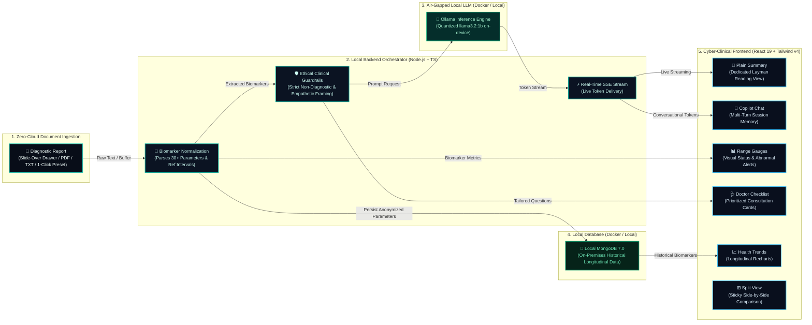

# ArogyaSutra 🏥
> **100% Air-Gapped, Privacy-First Medical Report Translation & Clinical Companion**  
> *Translates complex diagnostic lab panels into clear, empathetic, everyday language using intuitive layman analogies so patients and families can truly understand their health and act early — with zero cloud data uploads, zero third-party logging, and zero PHI leakage.*

[](https://startupgrantsindia.com/competitions/hack2heal-20-global-healthcare-innovation-hackathon)
[](LICENSE)
[](https://www.typescriptlang.org/)
[](https://react.dev/)
[](https://tailwindcss.com/)
[](https://ollama.ai/)
[](https://www.docker.com/)
[](https://www.mongodb.com/)

---

## 🌟 Submission Overview

- **Project Title:** ArogyaSutra (आरोग्यसूत्र) v2.0
- **Hackathon:** Hack2Heal 2.0 — Global Healthcare Innovation Hackathon (Organized by IEM)
- **Elevator Pitch:** An air-gapped on-device clinical companion that turns intimidating laboratory panels into reassuring, plain-language insights and doctor consultation questions without exposing private health data to the cloud.
- **Repository:** [https://github.com/prabhattopi/arogyasutra](https://github.com/prabhattopi/arogyasutra)
- **Tech Stack:** React 19, TypeScript, Vite, Tailwind CSS v4, Node.js, Express, Local MongoDB 7.0, Local Ollama (`llama3.2:1b`), Docker Compose.

---

## 💡 Inspiration & The Clinical Challenge

Every time a family receives a diagnostic blood panel or discharge summary, the same anxious cycle unfolds:
1. **Deciphering Incomprehensible Jargon:** Confronting clinical terms like *"elevated alkaline phosphatase,"* *"toxic granulation in neutrophils,"* or *"microcytic hypochromasia."*
2. **Panic-Inducing Web Searches:** Frantic search engine queries predict worst-case diagnoses, amplifying emotional distress.
3. **Severe Privacy Risks:** Uploading sensitive Protected Health Information (PHI) to commercial cloud AI models creates corporate logging and biometric identity leakage risks.

**ArogyaSutra** solves this challenge with an **air-gapped, on-premise architecture**:
- **0 Bytes to Cloud:** PDF parsing, OCR text extraction, and quantized LLM inference run strictly within the local host.
- **Human-Friendly Layman Analogies:** Uses everyday concepts (oxygen delivery vehicles, immune defense soldiers, water filters) so non-experts have immediate clarity without anxiety.
- **Doctor Partnership:** Equips patients with prioritized, intelligent questions to discuss during physician consultations.

---

## 🏗️ Visual Architecture & Data Flow



---

## 🚀 Key Features & Innovations

### 1. 🗂️ Slide-Over Side Drawer for Document Ingestion
- Ingestion controls (drag-and-drop file upload, raw clinical text paste, and 1-click verified test cases) are hosted in a sleek, glassmorphic **slide-over side drawer**.
- Maximizes 100% of vertical screen real estate for the active report, visual gauges, and conversational copilot.

### 2. 📑 6-Tab Unified Demystify Experience
Everything related to the active medical report is organized into 6 focused tabs:
1. **📄 Plain Summary (सरल सारांश):** Full-width, distraction-free reading of gentle reassurance, key findings explained in plain language, and actionable next steps. Includes 1-click copy and print/export.
2. **💬 AI Copilot Chat (AI साथी चैट):** Multi-turn conversational companion grounded in the active report. Supports dynamic suggested questions, collapsible question trays, and Hinglish understanding.
3. **📊 Biomarkers & Vitals:** Interactive visual range gauges with min/max healthy intervals and status pills (`LOW`, `NORMAL`, `HIGH`).
4. **🩺 Doctor Checklist:** High-priority, evidence-grounded questions tailored to flagged parameters to empower patient-physician dialogue.
5. **📈 Health Trends:** Multi-visit longitudinal charts (Recharts) tracking parameters across clinical checkups.
6. **⊞ Split View:** Side-by-side view with sticky summary cards pinned alongside the biomarker table without empty voids.

### 3. 🧠 Layman-Friendly Everyday Analogies
Complex pathology is automatically translated into concepts anyone can grasp:
- **Hemoglobin:** *"Oxygen delivery vehicle / delivery truck"* carrying fuel to muscles and tissues.
- **White Blood Cells (WBC):** *"Immune defense soldiers"* clearing temporary infection or inflammation.
- **Platelets:** *"Natural repair band-aids"* preventing bleeding and sealing micro-vessels.
- **Creatinine & eGFR:** *"Fine biological water filters"* processing waste from daily protein metabolism.
- **Cholesterol (LDL vs HDL):** *"Arterial delivery trucks vs street sweepers"* maintaining clean vascular walls.

### 4. 🔄 Multi-Turn Session Memory (Persistent Across Tabs & Languages)
- Switching between tabs (`Plain Summary` $\rightarrow$ `Biomarkers` $\rightarrow$ `Doctor Checklist` $\rightarrow$ `AI Copilot`) retains conversation history without wiping.
- Toggling between English and Hindi retains past chat history while directing subsequent responses in the chosen language.
- Chat session resets cleanly only when a brand-new report is uploaded or the browser is refreshed.

### 5. ⚠️ Interactive Range Alerts
- An intelligent warning badge (`⚠️ 9 Alerts Outside Range`) calculates out-of-range parameters.
- Clicking the badge instantly navigates to the biomarker table to highlight flagged indicators for immediate inspection.

### 6. 🌐 Multilingual Typography & Harmony (English & हिंदी)
- Fully localized key-based i18n dictionary ([`client/src/i18n/translations.ts`](client/src/i18n/translations.ts)).
- Optimized Devanagari typography using **Poppins** font with tailored line-height (`1.85`), zero negative letter-spacing, and aligned status badges for seamless reading rhythm.

---

## ⚡ Key Pipeline Stages

| Stage | Icon | Component | What Happens |
| :--- | :---: | :--- | :--- |
| **Ingestion** | 📄 | Slide-Over Side Drawer | Ingests CBC, Metabolic, or Lipid panels (PDF, text, or 1-click presets). |
| **Extraction** | 🔬 | Normalization Engine | Extracts 30+ biomarkers (Hb, WBC, Glucose, HbA1c, Creatinine, etc.) and reference intervals. |
| **Safety Guardrails** | 🛡️ | Ethical Prompt Framework | Enforces strict non-diagnostic, non-prescriptive, reassuring layperson guidance. |
| **Local Inference** | 🧠 | Ollama (`llama3.2:1b`) | Quantized on-device LLM processes tokens with zero bytes leaving the local machine. |
| **Live Streaming** | ⚡ | Server-Sent Events (SSE) | Tokens stream smoothly into the UI in real time with minimal latency. |
| **Air-Gapped Storage** | 🍃 | Local MongoDB (`mongo:7.0`) | Anonymized longitudinal parameters are stored locally on-device. |
| **Presentation** | 🎨 | React 19 + Cyber-Clinical Theme | Obsidian dark surfaces, visual range gauges, doctor consultation cards, and responsive drawers. |

---

## 🧪 Built-In Test Sample Reports

Test immediately with 1 click from the dashboard or drawer:

| Sample Report | Scenario | Highlights |
| :--- | :--- | :--- |
| **Complete Blood Count (CBC)** | Microcytic Anemia & Infection | Hemoglobin 9.4 (Low), RBC 3.35 (Low), WBC 13,800 (High), Neutrophils 78% (High) |
| **Comprehensive Metabolic Panel** | Diabetes & Renal Stress | Fasting Glucose 168 (High), HbA1c 8.2% (High), Creatinine 1.45 (High), eGFR 54 (Low) |
| **Cardiovascular & Lipid Panel** | High Cholesterol & Inflammation | Total Cholesterol 252 (High), LDL 172 (High), hs-CRP 3.8 (High), ApoB 132 (High) |

---

## 📋 System Prerequisites & Quick Download Links

ArogyaSutra supports two seamless execution workflows: **Direct Local Development** (instant hot-reload) and **100% Air-Gapped Docker Containerization** (single-command production stack).

### Required Software by Operating System

| Software | Windows | macOS | Linux (Ubuntu/Debian) | Purpose |
| :--- | :--- | :--- | :--- | :--- |
| **Node.js (v20+ LTS)** | [Download Windows (.msi)](https://nodejs.org/) <br>or `winget install OpenJS.NodeJS.LTS` | [Download macOS (.pkg)](https://nodejs.org/) <br>or `brew install node` | `sudo apt update && sudo apt install nodejs npm` <br>or [NodeSource LTS](https://github.com/nodesource/distributions) | Runs Vite client & Express backend |
| **Ollama** | [Download for Windows](https://ollama.com/download/windows) | [Download for macOS](https://ollama.com/download/mac) | `curl -fsSL https://ollama.com/install.sh \| sh` <br>or [Linux Guide](https://ollama.com/download/linux) | Local on-device LLM inference (`llama3.2:1b`) |
| **Docker Desktop** *(for Docker Mode)* | [Docker Desktop for Windows](https://docs.docker.com/desktop/setup/install/windows-install/) | [Docker Desktop for Mac](https://docs.docker.com/desktop/setup/install/mac-install/) | [Docker Engine for Linux](https://docs.docker.com/engine/install/) | Automated air-gapped container stack |
| **Git** | [Git for Windows](https://git-scm.com/download/win) | `brew install git` <br>or [Git macOS](https://git-scm.com/download/mac) | `sudo apt install git` <br>or [Git Linux](https://git-scm.com/download/linux) | Repository cloning & version control |
| **MongoDB Compass** *(Optional GUI)* | [Compass for Windows](https://www.mongodb.com/try/download/compass) | [Compass for Mac](https://www.mongodb.com/try/download/compass) | [Compass for Linux](https://www.mongodb.com/try/download/compass) | Inspect local documents with an Atlas-like UI |

> [!NOTE]
> **Zero-Dependency In-Memory Fallback:** If local MongoDB is not running during direct development, ArogyaSutra's smart database orchestrator seamlessly switches to **High-Speed In-Memory Mode** without crashing or throwing errors. As soon as MongoDB is started, it auto-reconnects in the background!

---

## 🚀 Running Mode 1: Direct Local Development (Fastest)

Ideal for live evaluation, rapid UI iteration, and testing without waiting for container build times:

### Step 1: Pull the Local Quantized Model
Open your terminal and run:
```bash
ollama run llama3.2:1b
```
*(Once loaded, you can exit the chat prompt with `/bye`; Ollama will remain active in the background on port `11434`)*

### Step 2: Start Backend Server
In a new terminal window:
```bash
cd server
npm install
npm run dev
```
- API Orchestrator listens at: **`http://localhost:5000`**
- Healthcheck endpoint: **`http://localhost:5000/api/health`**

### Step 3: Start Frontend Client
In another terminal window:
```bash
cd client
npm install
npm run dev
```
- Vite Client listens at: **`http://localhost:5173`**

### Step 4: Open in Browser
Open **`http://localhost:5173`** in Chrome, Edge, or Brave.

---

## 🐳 Running Mode 2: 100% Air-Gapped Docker Mode (One-Click)

Run the entire multi-container production stack (Ollama, MongoDB 7.0, Express API, and React 19 Nginx frontend) with our automated runner script:

```bash
# In project root:
bash ./run.sh
```

### What `run.sh` Automates:
1. **Docker Engine Healthcheck:** Confirms Docker engine is active.
2. **Safe Project Isolation:** Gracefully resets existing project containers without touching external databases.
3. **Spins up Containers:** Builds and starts `arogyasutra-mongodb`, `arogyasutra-ollama`, `arogyasutra-backend`, and `arogyasutra-frontend`.
4. **Auto-Resolves LLM Weights:** Automatically pulls quantized `llama3.2:1b` into the local container volume.
5. **Ready Notification:** Displays direct links to the live frontend (`localhost:5173`) and API (`localhost:5000`).

To inspect database documents in Docker using `mongosh`:
```bash
docker exec -it arogyasutra-mongodb mongosh arogyasutra --eval "db.reports.find().pretty()"
```

To connect with MongoDB Compass GUI, use connection string:
```text
mongodb://localhost:27017
```

---

## 🛡️ Clinical Guardrails & Disclaimers

> [!IMPORTANT]
> **Educational Tool Notice:** ArogyaSutra is strictly an educational companion designed to empower doctor-patient discussions. It does not provide medical diagnoses, clinical staging, or prescription medication advice. Always consult a licensed healthcare practitioner for clinical treatment decisions.

---

## 👥 Hackathon Team

- **Event:** Hack2Heal 2.0 Global Healthcare Innovation Hackathon
- **Track:** Patient Education, Vernacular Access & Air-Gapped Healthcare AI
- **Repository:** [https://github.com/prabhattopi/arogyasutra](https://github.com/prabhattopi/arogyasutra)
