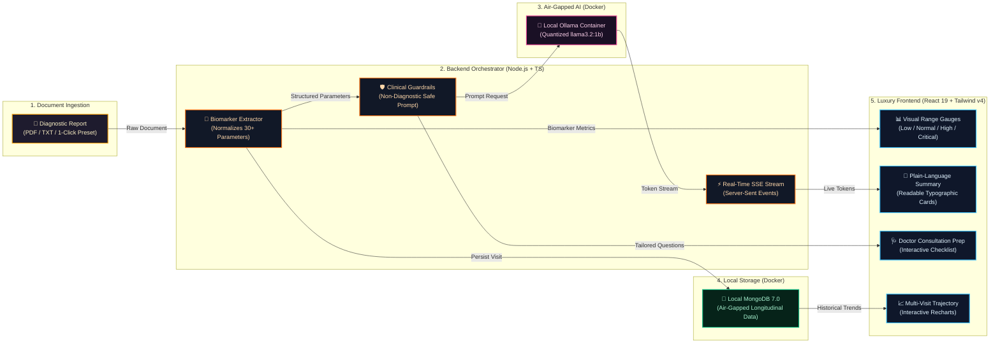

# ArogyaSutra 🏥
> **Privacy-First, On-Premise Medical Report Companion**  
> *Translates complex diagnostic lab reports into clear, empathetic, everyday language so patients and families can truly understand their health and act early — with 100% on-device air-gapped privacy.*

[](https://startupgrantsindia.com/competitions/hack2heal-20-global-healthcare-innovation-hackathon)
[](LICENSE)
[](https://www.typescriptlang.org/)
[](https://react.dev/)
[](https://tailwindcss.com/)
[](https://ollama.ai/)
[](https://www.docker.com/)
[](https://www.mongodb.com/)

---

## 🌟 Submission Overview

- **Project Title:** ArogyaSutra
- **Hackathon:** Hack2Heal 2.0 - Global Healthcare Innovation Hackathon (Organized by IEM)
- **Elevator Pitch:** Translates complex lab reports into simple, everyday language so patients and families can truly understand their health and act early.
- **Repository:** [https://github.com/prabhattopi/arogyasutra](https://github.com/prabhattopi/arogyasutra)
- **Tags:** `react`, `node.js`, `express.js`, `mongodb`, `ollama`, `local-llm`, `javascript`, `tailwind-css`, `ai`, `machine-learning`, `healthcare`, `typescript`.

---

## 💡 Inspiration & The Clinical Challenge

Every time a family receives a diagnostic blood panel or discharge summary, the same anxious cycle unfolds:
1. **Deciphering Incomprehensible Jargon:** Confronting clinical terms like *"elevated alkaline phosphatase,"* *"toxic granulation in neutrophils,"* or *"microcytic hypochromasia."*
2. **Panic-Inducing Web Searches:** Frantic web searching predicts worst-case diagnoses, amplifying distress.
3. **Severe Privacy Risks:** Uploading sensitive Protected Health Information (PHI) to cloud AI models creates corporate logging and identity leakage vulnerabilities.

**ArogyaSutra** solves this challenge: a **100% air-gapped, on-premise medical report companion** running entirely on-device via quantized local models in **Ollama** and a **local Docker MongoDB database** — zero cloud data uploads, zero third-party logging, and zero data leakage.

---

## 🏗️ Visual Architecture & Data Flow



---

## ⚡ Key Pipeline Stages

| Stage | Icon | Component | What Happens |
| :--- | :---: | :--- | :--- |
| **Ingestion** | 📄 | Drag-and-Drop / 1-Click | Ingests CBC, Metabolic, or Lipid reports (PDF, text, or sample buttons). |
| **Extraction** | 🔬 | Normalization Engine | Extracts 30+ biomarkers (Hb, WBC, Glucose, HbA1c, Creatinine, etc.) and reference intervals. |
| **Safety Guardrails** | 🛡️ | Ethical Prompt Framework | Enforces strict non-diagnostic, non-prescriptive, empathetic guidance. |
| **Local Inference** | 🧠 | Dockerized Ollama (`llama3.2:1b`) | Quantized on-device LLM processes tokens with 0 bytes leaving your machine. |
| **Live Streaming** | ⚡ | Server-Sent Events (SSE) | Words stream smoothly into the UI in real time with zero latency lag. |
| **Air-Gapped Storage** | 🍃 | Local Docker MongoDB (`mongo:7.0`) | Anonymized longitudinal parameters are stored locally on your device. |
| **Presentation** | 🎨 | React 19 + Sunset Orange Theme | Visual range gauges, plain-language cards, consultation checklists, and Recharts. |

---

## 🚀 Quick Start (Automated Bash Script)

Our intelligent Git Bash script handles Docker container creation, local MongoDB setup, model auto-resolution, and launching everything in one command:

```bash
# Open Git Bash in arogyasutra/
bash ./run.sh
```

**How the script intelligently operates:**
1. **Scoped Safe Cleanup:** Only recreates `arogyasutra` project containers without touching your other containers (e.g. Postgres).
2. **Local MongoDB & Ollama:** Starts both local `arogyasutra-mongodb` (Mongo 7.0) and `arogyasutra-ollama` containers.
3. **Auto-Detects Models:** If a model is already installed in your Ollama container, it picks it immediately. If not, it pulls the fast, ultra-smart `llama3.2:1b`.
4. **Launches Fullstack App:** Automatically starts backend (`localhost:5000`) and frontend (`localhost:5173`).

### Pass a Custom Model (Optional)
```bash
# If your machine has high hardware specs:
bash ./run.sh llama3.2:3b
bash ./run.sh qwen2.5:1.5b
bash ./run.sh mistral
```

---

## 🛠️ Manual Local Development (Outside Docker)

```bash
# 1. Install dependencies
npm run install:all

# 2. Start local stack concurrently
npm run dev
```

- **Frontend:** [http://localhost:5173](http://localhost:5173)
- **Backend API:** [http://localhost:5000](http://localhost:5000)
- **Diagnostics:** [http://localhost:5000/api/health](http://localhost:5000/api/health)

---

## 🌐 Extensible Multilingual Support (i18n)

ArogyaSutra includes a modular key-based JSON dictionary in [`src/i18n/translations.ts`](client/src/i18n/translations.ts).
- Toggle between **English** and **हिंदी** directly from the top navigation bar.
- The entire interface (titles, sample presets, metric tables, status pills, consultation cards) updates instantly.
- New vernacular languages (Bengali, Tamil, Marathi) can be added simply by defining their translation keys in the dictionary.

---

## 🧪 Built-In Test Sample Reports

Located in [`sample-reports/`](sample-reports/) and loadable from the dashboard with 1 click:

| Sample Report | Scenario | Highlights |
| :--- | :--- | :--- |
| **`cbc_blood_report.txt`** | Microcytic Anemia & Infection | Hemoglobin 9.4 (Low), RBC 3.35 (Low), WBC 13,800 (High) |
| **`metabolic_panel.txt`** | Diabetes & Renal Stress | Glucose 168 (High), HbA1c 8.2% (High), Creatinine 1.45 (High) |
| **`lipid_cardiac_panel.txt`**| High Cholesterol & Inflammation | Total Cholesterol 252 (High), LDL 172 (High), hs-CRP 3.8 (High) |

---

## 🎬 3-Minute Hackathon Video Blueprint

Follow the second-by-second presentation walkthrough in [DEMO_SCRIPT.md](DEMO_SCRIPT.md) for recording your Hack2Heal 2.0 submission video.
